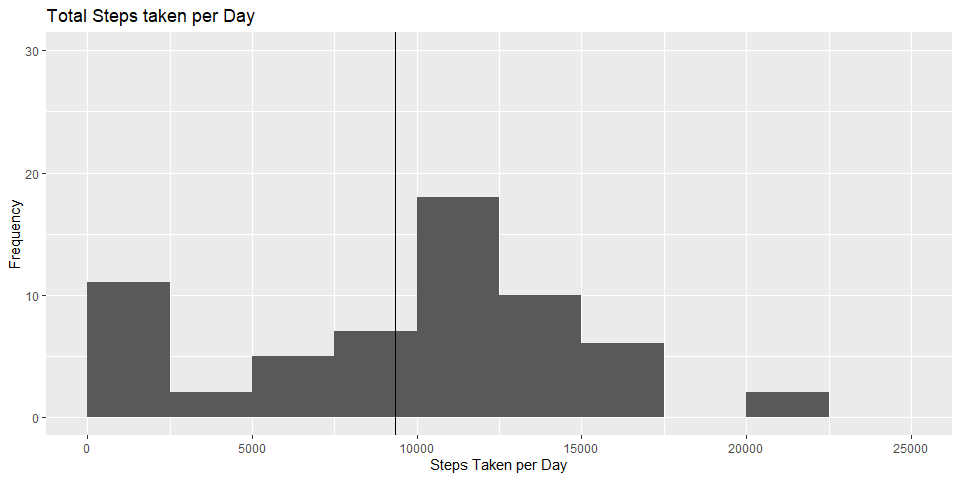
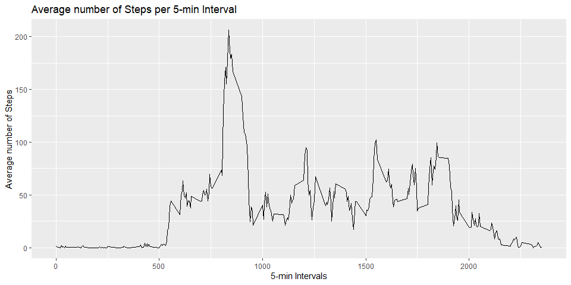
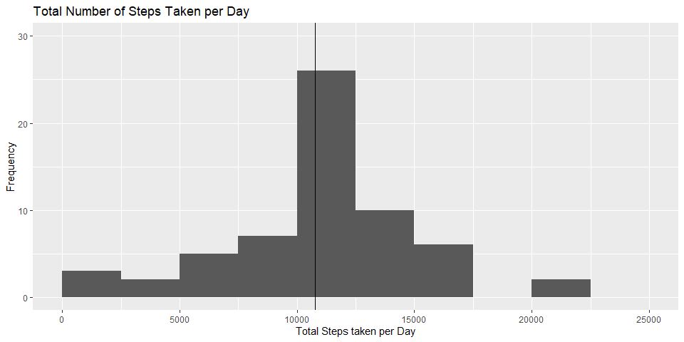
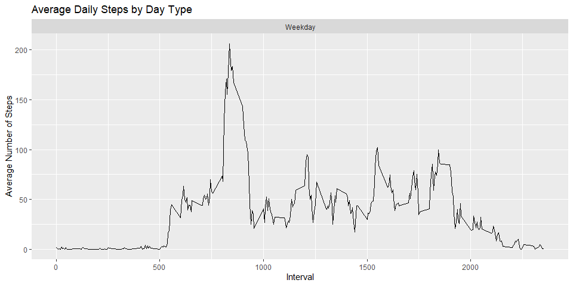

## Global Options and Libraries

```r
knitr::opts_chunk$set(echo = TRUE, warning = FALSE, fig.width = 10, fig.height = 5, fig.keep = 'all' ,fig.path = 'figures\ ', dev = 'png')
library(ggplot2)
options(Scipen = 999)
```

## Loading and preprocessing the data

```r
# dataset with NA values
activity <- read.csv(unzip("activity.zip"))

# Setting date format to help get the weekdays of the dates
activity$date <- as.POSIXct(activity$date, "%Y%m%d")

# Getting the days of all the dates on the dataset
day <- weekdays(activity$date)

# Combining the dataset with the weekday of the dates
activity <- cbind(activity, day)
```


## What is mean total number of steps taken per day?


```r
# Calculating total steps taken on a day
activityTotalSteps <- with(activity, aggregate(steps, by = list(date), sum, na.rm = TRUE))

# Changing col names
names(activityTotalSteps) <- c("Date", "Steps")

# Converting the data set into a data frame to be able to use ggplot2
totalStepsdf <- data.frame(activityTotalSteps)

# mean of total steps taken per day
meanStepsperDay <- mean(activityTotalSteps$Steps)

#median of total steps taken per day
medianStepsperDay <- median(activityTotalSteps$Steps)

#plotting a histogram for the steps taken per day
stepsTakenGraph <- ggplot(totalStepsdf, aes(x = Steps)) +
      geom_histogram(breaks = seq(0,25000,by = 2500)) +
      geom_vline(xintercept= meanStepsperDay) + 
      ylim(0,30) +
      labs(x = "Steps Taken per Day", 
           y = "Frequency", 
           title = "Total Steps taken per Day") 
```

The mean of steps taken per day are: 9354.2295082

The median of steps taken per day are: 10395

<!-- -->


## What is the average daily activity pattern?

```r
# Calculating the average number of steps taken, averaged across all days by 5-min intervals.
averageDailyActivity <- aggregate(activity$steps, by = list(activity$interval), 
                                  FUN = mean, na.rm = TRUE)
# Changing col names
names(averageDailyActivity) <- c("Interval", "Mean")

# Converting the data set into a dataframe
averageActivitydf <- data.frame(averageDailyActivity)

# Ploting Average number of steps per 5-min interval

averageSteps5Graph <- ggplot(averageActivitydf, mapping = aes(Interval, Mean)) + 
      geom_line() + 
      labs(x = "5-min Intervals",
           y = "Average number of Steps",
           title = "Average number of Steps per 5-min Interval")

print(averageSteps5Graph)
```

<!-- -->

The 5-minute interval which contains the maximum numbers of steps is: 

835  


## Imputing missing values

Calculating all the variables: 


```r
# sum of NAs in steps collumn 
sumNAsteps <- sum(is.na(activity$steps))

# Matching the mean of daily activity with the missing values
imputedSteps <- averageDailyActivity$Mean[match(activity$interval, averageDailyActivity$Interval)]

# Transforming steps in activity if they were missing values with the filled values from above.
activityImputed <- transform(activity, 
                             steps = ifelse(is.na(activity$steps), yes = imputedSteps, no = activity$steps))

# Forming the new dataset with the imputed missing values.
totalActivityImputed <- aggregate(steps ~ date, activityImputed, sum)

# Changing col names
names(totalActivityImputed) <- c("date", "dailySteps")

# Converting the data set into a data frame to be able to use ggplot2
totalImputedStepsdf <- data.frame(totalActivityImputed)

# mean number of steps taken per day
meanDay <- mean(totalActivityImputed$dailySteps)

#median number of steps taken per day
medianDay <- median(totalActivityImputed$dailySteps)

# Plotting a histogram using ggplot2
histGraph <- ggplot(totalImputedStepsdf, aes(x = dailySteps)) + 
      geom_histogram(breaks = seq(0, 25000, by = 2500)) + 
      geom_vline(xintercept = meanDay) + 
      ylim(0,30) +
      labs(x = "Total Steps taken per Day",
           y = "Frequency",
           title = "Total Number of Steps Taken per Day")
```

The sum of NAs is: 2304

The mean value of total steps taken per day: 1.0766189\times 10^{4}

The median value of total steps taken per day: 1.0766189\times 10^{4}


```r
histGraph
```

<!-- -->

## Are there differences in activity patterns between weekdays and weekends?


```r
# Updating format of the dates
activity$date <- as.Date(strptime(activity$date, format="%Y-%m-%d"))

# Creating a function that distinguises weekdays from weekends
activity$dayType <- sapply(activity$date, function(x) {
       if(weekdays(x) == "Saturday" | weekdays(x) == "Sunday")
       {y <- "Weekend"}
       else {y <- "Weekday"}
       y
})

# Creating the data set that will be plotted
activityByDay <-  aggregate(steps ~ interval + dayType, activity, mean, na.rm = TRUE)

# Plotting using ggplot2
ggplot(activityByDay, aes(x = interval , y = steps)) + 
      geom_line() + 
      labs(x = "Interval", 
           y = "Average Number of Steps",
           title = "Average Daily Steps by Day Type") + 
      facet_wrap(~dayType, ncol = 1, nrow=2)
```

<!-- -->
